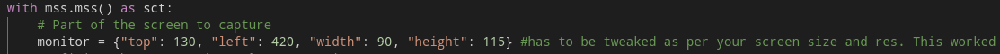
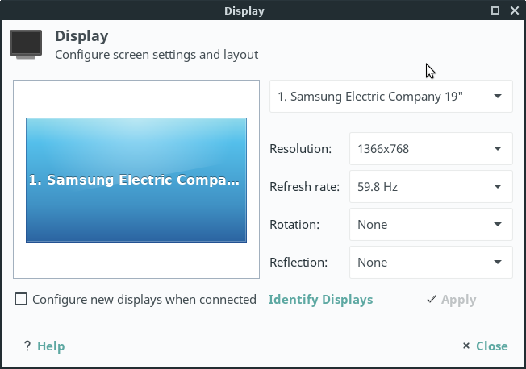
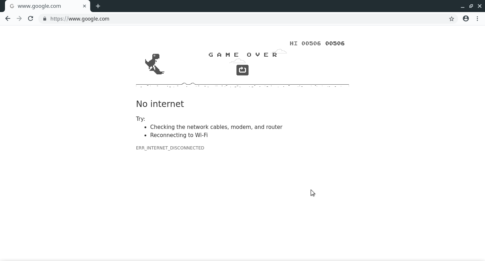

# dinobot
A simple, fast and basic BOT for playing the Google Chrome's Dinosaur game. Jusr for fun :)
This bot can't skip birds.

# Requirements
* Python 3.x (Try to get the latest)
* OpenCV Python Module 3.4
* pynput
* mss
* numpy

# How to setup

Well, its not too complex. But, may require some time (depends on your guessing power)
This scripts takes data from image (using mss). So, you have to tweak the **top**, **left**, **height**, **width** as per your *screen size* and *resolution*

**The values used in the script are tested on my machine. And, they work finw. See my screen info below, for reference.**

**Make Chrome/Chromium window maximised to avoid any false detection on OpenCV**

# My Best Score using this script

# LICENSE

GNU General Public License v3.0

**I may rewrite this project to avoid these gotchas. And, add bird skip support**
